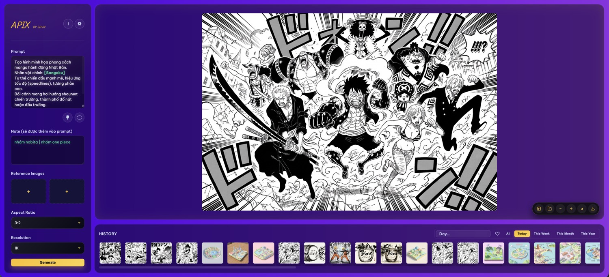

# aPix Image Workspace

## Tiếng Việt
### Giới thiệu
aPix Image Workspace là một giao diện Flask nhẹ giúp bạn tạo hình ảnh bằng API Model Gemini Image 3 Pro (Nano Banana Pro). Bạn có thể gửi prompt, upload tài liệu tham khảo và điều chỉnh tỷ lệ khung hình/độ phân giải.

### Người tạo
- Người tạo: [Phạm Hưng](https://www.facebook.com/phamhungd/)
- Group: [SDVN - Cộng đồng AI Art](https://www.facebook.com/groups/stablediffusion.vn/)
- Website: [sdvn.vn](https://www.sdvn.vn)
- Donate: [sdvn.vn/donate](https://stablediffusion.vn/donate/)

### Khởi chạy nhanh bằng `run_app`
1. Nháy đúp vào `run_app.command` trên macOS, `run_app.sh` trên Linux, hoặc `run_app.bat` trên Windows để tự động tìm Python, tạo `.venv`, cài `requirements.txt` và khởi động `app.py`.
2. Mở `http://127.0.0.1:8888`, nhập prompt/tùy chọn rồi nhấn Generate.
3. Hình ảnh mới nằm trong `static/generated/`; `/gallery` thể hiện lịch sử.

### Sử dụng
1. Đặt biến môi trường `GOOGLE_API_KEY` với API key của Google GenAI hoặc nhập trực tiếp trong giao diện.
2. Mở trình duyệt tới `http://127.0.0.1:8888`, nhập prompt, chọn tùy chọn và nhấn Generate.  
3. Hình ảnh: `static/generated` lưu nội dung mới nhất, còn `/gallery` trả về URL cho phần lịch sử.

### Cú pháp đặc biệt
Ứng dụng hỗ trợ cú pháp placeholder để tạo nhiều biến thể ảnh hoặc thay thế nội dung linh hoạt:

*   **Placeholder:** Sử dụng `{text}` hoặc `[text]` trong prompt. Ví dụ: `A photo of a {animal} in the style of {style}`.
*   **Trường Note:** Nội dung trong trường Note sẽ thay thế cho placeholder:
    *   **Thay thế đơn:** Nếu Note là `cat`, prompt sẽ thành `A photo of a cat...`.
    *   **Hàng đợi (Queue):** Nếu Note chứa ký tự `|` (ví dụ: `cat|dog|bird`), ứng dụng sẽ tự động tạo 3 ảnh lần lượt với `cat`, `dog`, và `bird`.
    *   **Nhiều dòng:** Nếu Note có nhiều dòng, mỗi dòng sẽ ứng với một lần tạo ảnh.
    *   **Mặc định:** Nếu Note để trống, placeholder sẽ giữ nguyên hoặc dùng giá trị mặc định nếu có (ví dụ `{cat|dog}` sẽ tạo 2 ảnh nếu Note trống).
